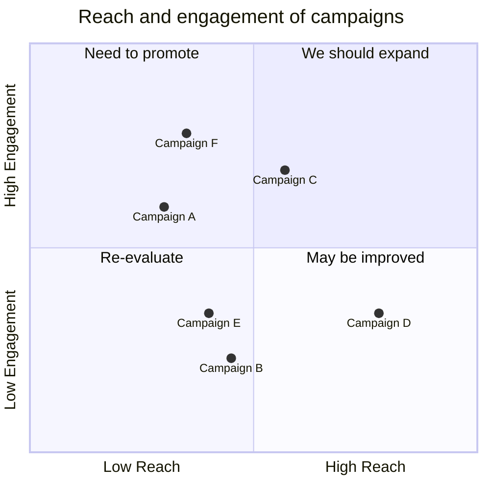

# Aprende en tu idioma

APRENDIZAJE HOLÍSTICO

Aprendizaje 360Una mezcla de seminarios socráticos, clases y talleres para mejorar tus habilidades técnicas.ComunidadProfundiza tu conocimiento con mentorías mensuales y horas de asesoría privada.InstructoresAprende de Bitcoiners con años de experiencia en la industria.Búsqueda laboralAyudamos a nuestros estudiantes durante su proceso de búsqueda laboral en la industria.

